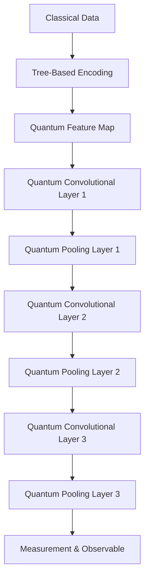

# Quantum Convolutional Neural Network with Tree-Based Encoding


## Overview
This project implements a **Quantum Convolutional Neural Network (QCNN)** using a novel **tree-based hybrid amplitude encoding** for input data. The goal is to leverage quantum circuits for efficient feature extraction and classification, inspired by classical CNNs but adapted for quantum hardware.

---

## Key Features

- **Tree-Based Hybrid Amplitude Encoding:**
  - Efficiently maps classical data to quantum states using a hierarchical, tree-like structure.
  - Scales input values between 0 and π for optimal quantum rotation gates.
  - Uses multi-controlled RY gates for complex entanglement and feature representation.

- **Quantum Convolutional Layers:**
  - Mimics classical convolution using parameterized quantum gates and entanglement.
  - Multiple layers for hierarchical feature extraction.

- **Quantum Pooling Layers:**
  - Reduces dimensionality and noise, similar to classical pooling.
  - Uses quantum gates to aggregate information.

- **Modular Design:**
  - Easily extendable for more layers or different encoding schemes.
  - Built with Qiskit and compatible with Qiskit Machine Learning.

---

## Visual Workflow



---

## How It Works

1. **Data Preparation:**
   - Input data is scaled and encoded into quantum states using the tree-based method.
2. **Feature Extraction:**
   - Quantum convolutional layers apply parameterized gates for feature extraction.
3. **Pooling:**
   - Quantum pooling layers reduce the number of qubits and aggregate features.
4. **Measurement:**
   - The final quantum state is measured using a custom observable (e.g., Z + I*7).

---

## Example Usage

```python
feature_map = tree_hybrid_amplitude_encoding([i for i in range(0, 256)])
ansatz = QuantumCircuit(8, name="Ansatz")
# Add convolutional and pooling layers
ansatz.compose(conv_layer(8, "c1"), list(range(8)), inplace=True)
ansatz.compose(pool_layer([0, 1, 2, 3], [4, 5, 6, 7], "p1"), list(range(8)), inplace=True)
# ... more layers ...
circuit = QuantumCircuit(8)
circuit.compose(feature_map, range(8), inplace=True)
circuit.compose(ansatz, range(8), inplace=True)
observable = SparsePauliOp.from_list([("Z" + "I" * 7, 1)])
circuit.draw('mpl')
```

---

## References
- [Quantum Convolutional Neural Networks (Cong et al., 2019)](https://arxiv.org/abs/1810.03787)
- [Tree-Based Quantum State Preparation (Zhang et al., 2022)](https://arxiv.org/abs/2202.11046)
- [Qiskit Machine Learning](https://qiskit.org/ecosystem/machine-learning/)

---

## License
MIT

---

## Author
*Your Name Here*

---

## Screenshot

